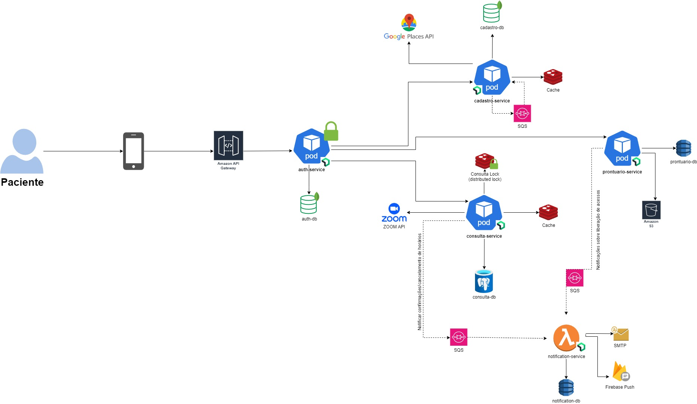
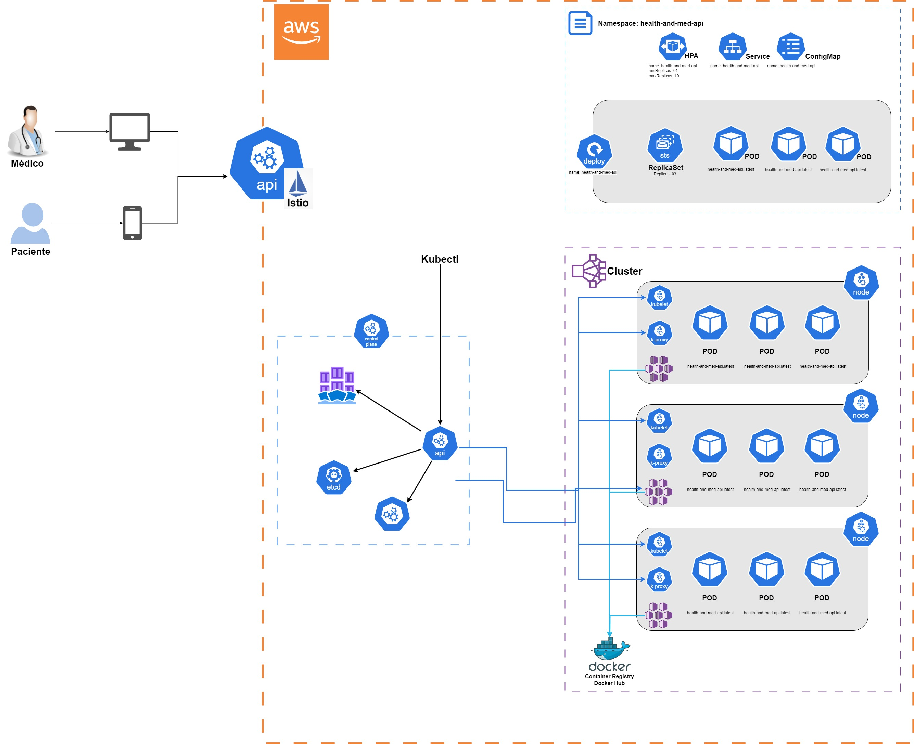

# Hackathon Health&Med

A Health&Med, uma startup inovadora no setor de saúde, está desenvolvendo um novo sistema que irá revolucionar a Telemedicina no país. Atualmente, a startup oferece a possibilidade de agendamento de consultas e realização de consultas online (Telemedicina) por meio de sistemas terceiros como Google Agenda e Google Meetings. 
Recentemente, a empresa recebeu um aporte e decidiu investir no desenvolvimento de um sistema proprietário, visando proporcionar um serviço de maior qualidade, segurança dos dados dos pacientes e redução de custos. O objetivo é criar um sistema robusto, escalável e seguro que permita o gerenciamento eficiente desses agendamentos e consultas. 
Além de conter as funcionalidades de agendamento e realização de consultas online, o sistema terá o diferencial de uma nova funcionalidade: o Prontuário Eletrônico. O Prontuário Eletrônico permitirá o armazenamento e compartilhamento de documentos, exames, cartão de vacinas, e outros registros médicos entre as partes envolvidas, garantindo maior assertividade nos diagnósticos. 
Para viabilizar o desenvolvimento de um sistema que esteja em conformidade com as melhores práticas de qualidade e arquitetura de software, a Health&Med contratou os alunos do curso (SOAT) para fazer a análise do projeto e a arquitetura do software. 

* Projeto criado pelos alunos da FIAP cursando pós graduação de arquiterura de software para o hackathon da turma 4SOAT

## Autores

- RM 350985: Adriano Eduardo de Lima | [@adrianolima](https://github.com/adrianolima)
- RM 350834: Fernando Andrauss Pereira dos Santos | [@andrauss](https://github.com/Andrauss)
- RM 351868: Guilherme Batista da Silva | [@gui326](https://github.com/gui326)
- RM 352031: Marco Aurelio Sobral de Barros | [@marcoasobral](https://github.com/marcoasobral)
- RM 351423: Mônica da Silva | [@monicadasilva](https://github.com/monicadasilva)

## Diagrams

![Services]

![Cloud] 
## Links

 - [Document](https://docs.google.com/document/d/1je8_gPBbDnRtXA6b7wbqdgh3RXq6ntDuDjobpLuA5LA/edit)
 - [Draw.io](https://app.diagrams.net/#G1XOYGx0tMhSciDjIOgD73xDl7Y2pCdl1V#%7B%22pageId%22%3A%220pTkZpLr6KHycclPthgg%22%7D)
 - [Miro](https://miro.com/app/board/uXjVKw-tZFs=/)
